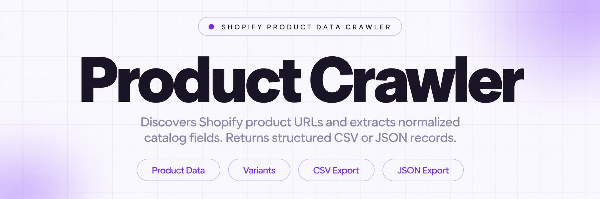
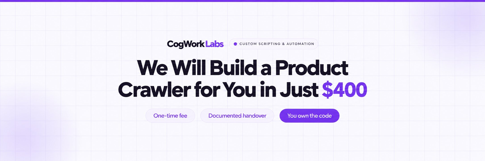
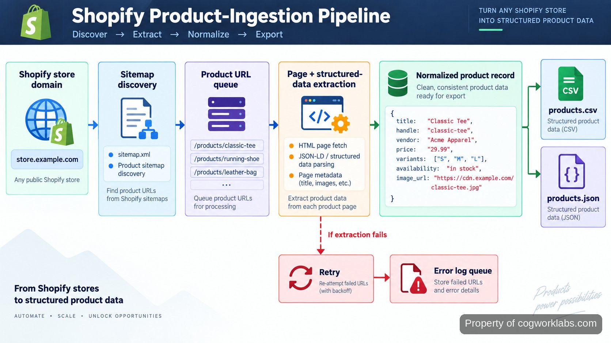

<p align="center">
  <a href="https://www.cogworklabs.com" target="_blank" rel="nofollow">
    
  </a>
</p>

## CogWorkLabs' shopify product crawler

CogWorkLabs' shopify product crawler is built for the repetitive part of product research: finding product URLs, opening each relevant page, extracting the same fields consistently, and returning records that can be used outside the storefront. The crawler starts from a Shopify store domain, uses available product discovery paths such as `sitemap.xml`, follows product URLs, and normalizes the fields it finds into a predictable record. Shopify stores automatically generate sitemaps containing product links, making the sitemap a useful first discovery source. :contentReference[oaicite:0]{index=0} The important distinction is that this is a data collection workflow, not a browser session that leaves information scattered across tabs.

A typical run separates discovery from extraction. That makes failures easier to identify: a missing product URL is a discovery problem; an incomplete title, price, variant, or image field is an extraction problem. The resulting CSV or JSON keeps those records separate from the crawl logs, so downstream analysis does not have to reconstruct what happened during the run.

<a href="https://www.cogworklabs.com" target="_blank" rel="nofollow">
  
</a>

<p align="center">
  <a href="https://t.me/Bitbash333" target="_blank" rel="nofollow">
    
  </a>&nbsp;
  <a href="https://wa.me/923249868488?text=Hi%2C%20I%27m%20interested%20in%20CogWorkLabs." target="_blank" rel="nofollow">
    
  </a>&nbsp;
  <a href="mailto:hello@cogworklabs.com" target="_blank" rel="nofollow">
    
  </a>&nbsp;
  <a href="https://www.cogworklabs.com" target="_blank" rel="nofollow">
    
  </a>
</p>

## Product discovery starts with the store's own structure

The first problem is coverage. Starting from a handful of collection pages can miss products that are not linked from the expected navigation path. Shopify's generated sitemap provides a stronger starting point because the platform documents separate sitemap resources for products, collections, blogs, and webpages. :contentReference[oaicite:1]{index=1} The crawler reads the product locations, canonicalizes URLs, removes duplicates, and creates a queue of pages to inspect.

When an authenticated storefront API is available, the same separation applies to API retrieval. Shopify's Storefront API exposes a paginated `products` query and supports product filtering and sorting. :contentReference[oaicite:2]{index=2} The build can therefore treat URL crawling and structured API retrieval as distinct acquisition paths rather than forcing every store into one method.

A concrete run might begin with `https://example-store.com/sitemap.xml`, identify the product sitemap, produce product URLs, then pass each URL into extraction. If the store exposes a product handle such as `/products/linen-shirt`, that handle becomes a stable identifier alongside the full URL. This prevents duplicate records when the same product appears through several storefront paths.

## Core Features

| Feature | Description |
| --- | --- |
| Sitemap-based discovery | Manual URL collection is easy to make incomplete. The crawler reads the store sitemap and builds a product URL queue from the store's published structure. |
| Structured product extraction | Copying product details by hand creates inconsistent columns. The parser extracts fields such as title, handle, description, vendor, price, availability, variants, and image URLs into one record shape. |
| HTML and structured-data parsing | Theme markup changes from store to store. The extraction layer can inspect page HTML and structured product data so fields do not depend on one CSS selector alone. |
| Pagination and queue handling | Large catalogs cannot be treated as one page. Product discovery and retrieval operate through a queue, allowing pagination and continuation without rebuilding the entire run. |
| CSV and JSON output | Raw scraped pages are awkward to analyse. The exporter writes normalized records to CSV or JSON so the output can move directly into spreadsheets, scripts, or downstream workflows. |
| Failure and retry logging | A crawler that silently skips pages creates false completeness. Failed URLs, parsing errors, HTTP responses, and retry outcomes are recorded separately from successful product records. |

## The workflow keeps discovery, extraction, and output separate



The workflow is intentionally staged. Discovery produces URLs; extraction turns each URL into raw fields; normalization applies one schema; validation checks required values; export writes the finished records. That sequence matters because a failed parser should not erase the discovery result, and a malformed product should not prevent the rest of the queue from completing.

For example, a product page can yield a title of `Linen Overshirt`, handle `linen-overshirt`, vendor `Northline`, price `79.00`, and two variants. The normalized record retains those values under fixed keys. If the price is absent, the record can be marked incomplete while the URL remains available in the run log for inspection. Shopify's product model explicitly supports variants and media, so those relationships are represented rather than flattened into unrelated text. :contentReference[oaicite:3]{index=3}

<a href="https://tally.so/r/b5QYLL?platform=GitHub&amp;format=Product+repo&amp;brand=CogWorkLabs&amp;niche=automation&amp;page=Shopify+Product+Crawler+for+Product+Catalogs&amp;date=2026-09-07" target="_blank" rel="nofollow">
  
</a>

## Normalization makes product records usable downstream

The main data problem is not retrieving HTML; it is producing records that remain comparable after retrieval. The normalization layer converts storefront-specific representations into stable fields. A product price is kept as a numeric value where possible, variant options remain associated with their variant, image links remain URLs, and the source page is preserved for traceability.

CSV output follows a tabular model suited to spreadsheet work, while JSON preserves nested structures such as variants and images more naturally. Shopify's own product CSV documentation shows why field dependencies matter: variant-related columns depend on option fields, and product exports can contain substantially different structures across catalogs. :contentReference[oaicite:4]{index=4} The crawler therefore avoids treating every field as an isolated string.

Validation happens before export. Required identifiers such as the source URL and product handle are checked first, then optional fields are retained when available. This produces a useful distinction between an empty field and a failed crawl, which is essential when the output is later compared against another catalog snapshot.

## Use Cases

- Catalog research teams can turn a Shopify storefront into structured product records instead of manually copying titles, prices, variants, and links into a spreadsheet.
- Ecommerce operators can capture a repeatable product snapshot and compare normalized records across separate crawl runs.
- Developers can feed CSV or JSON output into another script, database import, reporting process, or internal research workflow without first cleaning page HTML.
- Product analysts can isolate incomplete records and failed URLs from successful extraction results, making verification work targeted rather than manual across the whole catalog.

## The implementation follows Shopify's API and crawling constraints

The scripting layer is designed around Python's HTTP and parsing ecosystem, with structured data handled separately from page traversal. HTML parsing is useful for ordinary storefront pages; a browser-capable fallback can be used when content is rendered after the initial document load. The output layer uses standard CSV and JSON serialization so the generated files do not depend on a proprietary viewer.

Where API access is appropriate, the implementation follows Shopify's GraphQL Storefront API rather than treating the older REST storefront model as the default. Shopify documents the Storefront API as GraphQL-only, with versioned endpoints and paginated product queries. :contentReference[oaicite:5]{index=5} For private administrative catalog access, Shopify's GraphQL Admin API uses calculated query costs and publishes separate limits, so the acquisition path must match the permissions and data source actually available. :contentReference[oaicite:6]{index=6}

Crawling also has to respect platform protections. Shopify explicitly rate-limits automated traffic such as bots and crawlers, and recommends responsible retries, caching, request regulation, and error handling. :contentReference[oaicite:7]{index=7} The crawler therefore uses bounded retries and pauses rather than repeatedly requesting a failed page. A Storefront API tokenless query also has a documented query-complexity ceiling of 1,000, which makes field selection part of the extraction design rather than an afterthought. :contentReference[oaicite:8]{index=8}

## Project Directory

```text
shopify-product-crawler/
└── src/
    ├── crawler/
    │   ├── discovery.py
    │   ├── fetcher.py
    │   ├── parser.py
    │   ├── normalizer.py
    │   └── validator.py
    ├── exporters/
    │   ├── csv_writer.py
    │   └── json_writer.py
    ├── models.py
    ├── config.py
    ├── cli.py
    ├── tests/
    │   ├── test_discovery.py
    │   ├── test_parser.py
    │   └── test_normalizer.py
    ├── data/
    │   ├── output/
    │   └── logs/
    ├── .env.example
    ├── requirements.txt
    └── README.md
```